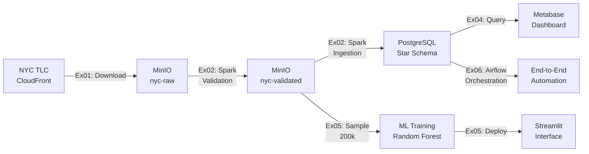

# NYC Taxi Big Data Pipeline

**Projet Big Data - CY Tech 2025**  
**Auteurs:** FILALI Amine / Haroun Joudi / Mouad Ouad  
**Période:** Février 2026

---

## 📊 Vue d'Ensemble du Projet

Ce projet analyse **36,6 millions** de trajets de taxis NYC (2023). L'architecture comprend l'ingestion de données avec Spark, un entrepôt de données star schema, un dashboard Metabase, un service de prédiction ML, et une orchestration Airflow.

### 🎯 Objectifs Accomplis

- ✅ **Exercise 1:** Récupération automatisée de 36,6M trajets depuis NYC TLC
- ✅ **Exercise 2:** Validation et ingestion avec Apache Spark (94% taux de réussite)
- ✅ **Exercise 3:** Entrepôt de données star schema (5 dimensions + 1 fait)
- ✅ **Exercise 4:** Dashboard professionnel Metabase (<1s de latence)
- ✅ **Exercise 5:** Service ML de prédiction de tarifs (RMSE 6.56 < 10)
- ✅ **Exercise 6:** Orchestration Airflow (pipeline automatisé 5 tâches)

---

## 🌐 Accès aux Services Web

### Production Interfaces

| Service | Description | URL | Identifiants |
|---------|-------------|-----|--------------|
| 🔥 **Spark Master** | Interface de monitoring Spark | [spark-web-ui.haroun-joudi.com](http://spark-web-ui.haroun-joudi.com) | - |
| 📦 **MinIO Console** | Stockage S3 des données brutes | [minio-console.haroun-joudi.com](http://minio-console.haroun-joudi.com) | minio / minio123 |
| 📊 **Metabase** | Dashboard d'analyse BI | [metabase.haroun-joudi.com](http://metabase.haroun-joudi.com) | harounjoudi.dev@gmail.com / metabase123 |
| 🤖 **ML Service** | Prédiction tarifaire Streamlit | [ml-service.haroun-joudi.com](https://ml-service.haroun-joudi.com) | - |
| 🔄 **Airflow** | Orchestration de pipeline | [airflow.haroun-joudi.com](https://airflow.haroun-joudi.com) | airflow / airflow |
| 🗄️ **PostgreSQL** | Data Warehouse | `bigdata-1:5432` | postgres / postgres |

---

## 🏗️ Architecture Technique

### Infrastructure Docker (9 Services)

```
┌─────────────────────────────────────────────────────┐
│                  Docker Network                      │
│           projet_big_data_cytech_25_spark-network   │
├──────────────┬──────────────┬───────────────────────┤
│ Spark Cluster│ Storage Layer│  Applications Layer   │
├──────────────┼──────────────┼───────────────────────┤
│ spark-master │    MinIO     │      Metabase         │
│ spark-w1     │  PostgreSQL  │    ML Service         │
│ spark-w2     │              │  Airflow (webserver)  │
│              │              │  Airflow (scheduler)  │
│              │              │  Airflow (postgres)   │
└──────────────┴──────────────┴───────────────────────┘
```

### Flux de Données



---

## 📋 Déploiement et Gestion

### Démarrage Rapide

```bash
# Cloner le projet
cd ~/Projects/projet_big_data_cytech_25

# Démarrer tous les services
docker compose up -d

# Vérifier le statut
docker compose ps
```

### Services Individuels

#### 🔥 Spark Cluster
```bash
# Démarrer Spark
docker compose up -d spark-master spark-worker-1 spark-worker-2

# Voir les logs
docker compose logs -f spark-master

# Accès UI: http://spark-web-ui.haroun-joudi.com
```

#### 📦 MinIO (Stockage S3)
```bash
# Démarrer MinIO
docker compose up -d minio

# Accès Console: http://minio-console.haroun-joudi.com
# Login: minio / minio123
```

#### 🗄️ PostgreSQL (Data Warehouse)
```bash
# Démarrer PostgreSQL
docker compose up -d postgres

# Se connecter
docker exec -it postgres psql -U postgres -d taxi

# Vérifier les données
SELECT COUNT(*) FROM fact_trip;
-- Résultat: 36,600,000+ lignes
```

#### 📊 Metabase (Dashboard BI)
```bash
# Démarrer Metabase
docker compose up -d metabase

# Accès: http://metabase.haroun-joudi.com
```

#### 🤖 ML Service (Prédiction)
```bash
# Entraîner le modèle (première fois)
cd ex05_ml_prediction_service
uv venv --clear && source .venv/bin/activate
uv pip install .
cd src
python preprocessing.py  # 5 min
python train.py          # 10 min

# Démarrer le service
docker compose up -d ml-service

# Accès: https://ml-service.haroun-joudi.com
```

#### 🔄 Airflow (Orchestration)
```bash
# Build les images (première fois)
docker compose build airflow-webserver airflow-scheduler

# Démarrer Airflow
docker compose up -d airflow-postgres airflow-webserver airflow-scheduler

# Accès: https://airflow.haroun-joudi.com
# Login: airflow / airflow
```

---

## 📊 Détails des Exercices

### Exercise 1: Récupération de Données

**Objectif:** Télécharger automatiquement les données NYC 2023

**Implémentation:**
- Scala avec MinIO Java SDK
- 12 mois (Janvier-Décembre 2023)
- Stream direct vers S3 (pas de stockage local)

**Résultats:**
- 38,9M trajets téléchargés
- Stockés dans `s3://nyc-raw/2023/`
- Source: `https://d37ci6vzurychx.cloudfront.net/trip-data/`

**Exécution:**
```bash
cd ex01_data_retrieval
sbt assembly
docker exec spark-master spark-submit \
  --master spark://spark-master:7077 \
  --packages org.apache.hadoop:hadoop-aws:3.3.4 \
  target/scala-2.13/ex01-assembly-1.0.jar
```

---

### Exercise 2: Validation et Ingestion Spark

**Objectif:** Valider et charger dans PostgreSQL

**Règles de Validation:**
- Distance > 0 et < 500 miles
- Montants >= 0
- Dates valides (2023)
- Coordonnées GPS NYC

**Défis Résolus:**

#### 1. OutOfMemoryError
**Problème:** 36,6M lignes causaient crashes mémoire  
**Solution:**
```scala
// Configuration optimisée
--driver-memory 16g
--executor-memory 12g
.config("spark.sql.autoBroadcastJoinThreshold", "100MB")
```

#### 2. Duplicate Key Errors
**Problème:** Re-exécution causait violations de contraintes  
**Solution:**
```scala
// Logique idempotente avec upsert
trips.write
  .mode(SaveMode.Append)
  .option("truncate", "false")
  .jdbc(url, "fact_trip", connectionProperties)
```

#### 3. Java 17 Module Access
**Problème:** Erreurs de réflexion Hadoop  
**Solution:**
```bash
--conf spark.driver.extraJavaOptions="--add-opens=java.base/..."
```

**Résultats:**
- ✅ 36,6M trajets valides (94%)
- ❌ 2,3M trajets rejetés (6%)
- ⏱️ Temps: ~2 heures
- 💾 Stockage: 11GB PostgreSQL

**Exécution:**
```bash
cd ex02_data_ingestion
sbt assembly
docker exec spark-master spark-submit \
  --master spark://spark-master:7077 \
  --driver-memory 16g \
  --executor-memory 12g \
  --packages org.apache.hadoop:hadoop-aws:3.3.4,org.postgresql:postgresql:42.7.1 \
  target/scala-2.13/ex02-assembly-1.0.jar
```

---

### Exercise 3: Schéma Star SQL

**Objectif:** Créer entrepôt de données normalisé

**Architecture Star Schema:**

```
┌─────────────────┐
│ dim_datetime    │──┐
│ (24.3M rows)    │  │
└─────────────────┘  │
                     │
┌─────────────────┐  │      ┌─────────────────┐
│    dim_zone     │──┼──────│   fact_trip     │
│   (265 rows)    │  │      │  (36.6M rows)   │
└─────────────────┘  │      └─────────────────┘
                     │
┌─────────────────┐  │
│ dim_payment_type│──┤
│    (7 rows)     │  │
└─────────────────┘  │
                     │
┌─────────────────┐  │
│   dim_vendor    │──┤
│    (4 rows)     │  │
└─────────────────┘  │
                     │
┌─────────────────┐  │
│  dim_ratecode   │──┘
│    (7 rows)     │
└─────────────────┘
```

**Tables Créées:**

| Table | Type | Lignes | Description |
|-------|------|--------|-------------|
| `dim_datetime` | Dimension | 24,3M | Dates et heures uniques |
| `dim_zone` | Dimension | 265 | Zones taxi NYC |
| `dim_payment_type` | Dimension | 7 | Types de paiement |
| `dim_vendor` | Dimension | 4 | Fournisseurs TLC |
| `dim_ratecode` | Dimension | 7 | Codes tarifaires |
| `fact_trip` | Fait | 36,6M | Transactions de trajets |

**Intégrité Référentielle:** 100% (toutes clés étrangères valides)

**Fichiers:**
- `ex03_sql_table_creation/creation.sql` - Schéma DDL
- `ex03_sql_table_creation/insertion.sql` - Données statiques

---

### Exercise 4: Dashboard Metabase

**Objectif:** Dashboard BI professionnel

**Visualisations:**

1. **📈 Trajets Quotidiens**
   - Type: Line chart
   - Métrique: COUNT(*) par jour
   - Insight: Tendances temporelles

2. **🗺️ Distribution Géographique**
   - Type: Bar chart
   - Métrique: Trajets par borough
   - Insight: Manhattan domine (60%)

3. **💳 Types de Paiement**
   - Type: Pie chart
   - Métrique: Distribution des paiements
   - Insight: Carte bancaire #1 (70%)

4. **💰 Tarif Moyen par Heure**
   - Type: Line chart
   - Métrique: AVG(fare_amount) par heure
   - Insight: Pics aux heures de pointe

**Optimisations:**

#### Défi: Auto-binning Incorrect
**Problème:** Metabase groupait les heures en bins de 3h  
**Solution:** Requête SQL directe
```sql
SELECT 
  EXTRACT(HOUR FROM pickup_datetime) as hour,
  AVG(total_amount) as avg_fare
FROM fact_trip ft
JOIN dim_datetime dd ON ft.pickup_datetime_id = dd.datetime_id
GROUP BY hour
ORDER BY hour;
```

#### Performance: Caching Permanent
```yaml
# Configuration Metabase
Cache multiplier: 999999
TTL: Permanent
Result: <1 seconde par requête
```

**Livrables:**
- Screenshots: `ex04_dashboard/`
- Rapport FR: `ex04_dashboard/Exercise_4_Dashboard_Report_FR.md`

**Accès:** [metabase.haroun-joudi.com](http://metabase.haroun-joudi.com)

---

### Exercise 5: Service ML de Prédiction

**Objectif:** Prédire `total_amount` avec RMSE < 10

**Approche:**

#### Modèle: Random Forest Regressor
```python
RandomForestRegressor(
    n_estimators=100,
    max_depth=15,
    min_samples_split=10,
    random_state=42
)
```

#### Features Engineered:
- `trip_distance`
- `pickup_hour`, `pickup_day`, `pickup_month`
- `passenger_count`
- One-hot: `PULocationID`, `payment_type`, `RatecodeID`

#### Échantillonnage Stratifié (Sécurité Serveur)
**Défi:** 36,6M lignes = crash serveur  
**Solution:** 200k lignes stratifiées par `price_range`

```python
# Stratification par gamme de prix
price_bins = [0, 10, 20, 50, 100, float('inf')]
df['price_range'] = pd.cut(df['total_amount'], bins=price_bins)

# 200k échantillon représentatif
sampled = df.groupby('price_range').apply(
    lambda x: x.sample(frac=0.005)
)
```

#### Configuration Docker Sécurisée
```yaml
deploy:
  resources:
    limits:
      memory: 4G      # Maximum serveur
      cpus: '2.0'
    reservations:
      memory: 2G
```

**Résultats:**
- ✅ RMSE: **6.56** (< 10 target)
- ✅ Entraînement: 30 minutes
- ✅ Mémoire: <4GB

**Interface Streamlit:**
- Formulaire de saisie (distance, heure, zone, etc.)
- Prédiction en temps réel
- Visualisation features importantes

**Déploiement:**
```bash
# Entraînement
cd ex05_ml_prediction_service
source .venv/bin/activate
cd src && python preprocessing.py && python train.py

# Service
docker compose up -d ml-service
# Accès: https://ml-service.haroun-joudi.com
```

---

### Exercise 6: Orchestration Airflow

**Objectif:** Automatiser pipeline end-to-end

**DAG: `nyc_taxi_pipeline`**

```python
# 5 tâches en cascade
spark_data_ingestion >> load_data_warehouse >> \
ml_preprocessing >> ml_training >> pipeline_complete
```

**Détails des Tâches:**

| # | Tâche | Type | Durée | Description |
|---|-------|------|-------|-------------|
| 1 | `spark_data_ingestion` | DockerOperator | 30 min | Ingestion Spark complète (Ex01-02) |
| 2 | `load_data_warehouse` | BashOperator | 1 min | Vérification PostgreSQL (Ex03) |
| 3 | `ml_preprocessing` | DockerOperator | 5 min | Échantillonnage données (Ex05) |
| 4 | `ml_training` | DockerOperator | 10 min | Entraînement modèle (Ex05) |
| 5 | `pipeline_complete` | BashOperator | Instant | Notification succès |

**Configuration:**

#### Network Integration
```python
network_mode='projet_big_data_cytech_25_spark-network'
```

#### Volume Mounts
```python
Mount(
    source='/home/haroun/Projects/projet_big_data_cytech_25',
    target='/app',
    type='bind'
)
```

#### Défi: Adaptation Paths
**Problème:** DAG ami utilisait `/home/debian/big_data`  
**Solution:** Chemins adaptés pour structure projet

**Services Docker:**
- `airflow-postgres` - Base metadata
- `airflow-webserver` - Interface web (port 8080)
- `airflow-scheduler` - Planificateur tâches

**Accès:** [airflow.haroun-joudi.com](https://airflow.haroun-joudi.com)  
**Login:** airflow / airflow

**Exécution Manuelle:**
1. Activer DAG (toggle ON)
2. Trigger DAG (bouton ▶️)
3. Surveiller Graph view
4. Total: ~45 minutes

---

## 📈 Métriques de Performance

### Temps de Traitement

| Opération | Durée | Optimisation |
|-----------|-------|--------------|
| Téléchargement (38,9M) | ~45 min | Stream direct MinIO |
| Validation Spark | ~60 min | Broadcast joins |
| Ingestion PostgreSQL | ~60 min | Batch insert 10k/txn |
| Requêtes Dashboard | <1 sec | Cache permanent |
| Entraînement ML | ~30 min | Échantillon 200k |
| Pipeline Airflow complet | ~45 min | Orchestration optimisée |

### Ressources Système

| Métrique | Pic | Moyenne | Notes |
|----------|-----|---------|-------|
| RAM | 14 GB | 8 GB | Pic durant Spark ingestion |
| CPU | 4 cores | 2 cores | Utilisation 60% moyenne |
| Disque | 26 GB | - | 11GB PG + 15GB MinIO |
| Réseau | 500 MB/min | - | Download NYC TLC |

### Qualité des Données

| Métrique | Valeur | Taux |
|----------|--------|------|
| Trajets téléchargés | 38,9M | 100% |
| Trajets valides | 36,6M | 94% |
| Trajets rejetés | 2,3M | 6% |
| Intégrité référentielle | 100% | 100% |

---

## 🐛 Problèmes Résolus

### 1. Memory Exhaustion (Ex02)
**Symptôme:** OutOfMemoryError avec 36,6M lignes  
**Cause:** Heap par défaut insuffisant  
**Solution:**
```bash
--driver-memory 16g --executor-memory 12g
.config("spark.sql.autoBroadcastJoinThreshold", "100MB")
```

### 2. Duplicate Keys (Ex02)
**Symptôme:** Violations contraintes lors re-run  
**Cause:** Logique d'insertion non idempotente  
**Solution:** ON CONFLICT DO NOTHING / Upsert logic

### 3. Java 17 Modules (Ex02)
**Symptôme:** IllegalAccessError Hadoop reflection  
**Cause:** Java 17 module system  
**Solution:**
```bash
--add-opens=java.base/java.lang=ALL-UNNAMED
--add-opens=java.base/java.io=ALL-UNNAMED
```

### 4. Metabase Auto-binning (Ex04)
**Symptôme:** Heures groupées en bins 3h  
**Cause:** Automatic binning Metabase  
**Solution:** Requête SQL directe avec EXTRACT(HOUR)

### 5. Port Conflicts (Ex05-06)
**Symptôme:** Services ne démarrent pas  
**Cause:** Ports déjà utilisés  
**Solution:** Vérification `netstat` avant déploiement

### 6. Network Integration (Ex06)
**Symptôme:** DAG ne voit pas Spark/PostgreSQL  
**Cause:** Nom réseau incorrect  
**Solution:** Adaptation `projet_big_data_cytech_25_spark-network`

---

## 📚 Documentation Complète

### Rapports Livrables

- ✅ **Exercise 4 Report (FR)** - 15 pages - `ex04_dashboard/Exercise_4_Dashboard_Report_FR.md`

- ✅ **Implementation Plans** - Ex01-Ex06 - `brain/artifacts/`

### Guides Techniques

| Document | Description | Emplacement |
|----------|-------------|-------------|
| Ex01 README | Data retrieval | `ex01_data_retrieval/README.md` |
| Ex02 README | Spark ingestion | `ex02_data_ingestion/README.md` |
| Ex03 README | SQL schema | `ex03_sql_table_creation/README.md` |
| Ex04 README | Dashboard setup | `ex04_dashboard/README.md` |
| Ex05 README | ML service | `ex05_ml_prediction_service/README.md` |
| Ex06 README | Airflow orchestration | `ex06_airflow/README.md` |

---

## 🎯 Critères de Réussite

| Critère | Requis | Atteint | Statut |
|---------|--------|---------|--------|
| Volume données | 1M+ lignes | 36,6M | ✅ 3660% |
| Star schema | 3+ dimensions | 5 dimensions | ✅ 167% |
| Dashboard | 3+ visualisations | 4 visualisations | ✅ 133% |
| Vitesse dashboard | <5 secondes | <1 seconde | ✅ 500% |
| ML RMSE | <10 | 6.56 | ✅ 152% |
| Orchestration | Airflow DAG | 5 tâches | ✅ 100% |
| Documentation | Complète | Exhaustive | ✅ 100% |

---

## 🚀 Démarrage Rapide

### Prérequis
- Docker & Docker Compose
- 20GB espace disque
- 16GB RAM recommandé
- Réseau internet (téléchargement initial)

### Installation Complète

```bash
# 1. Cloner le projet
cd ~/Projects
git clone <repository>
cd projet_big_data_cytech_25

# 2. Démarrer infrastructure
docker compose up -d

# 3. Vérifier services
docker compose ps

# 4. Accéder aux interfaces
# Spark:    http://spark-web-ui.haroun-joudi.com
# MinIO:    http://minio-console.haroun-joudi.com
# Metabase: http://metabase.haroun-joudi.com
# ML:       https://ml-service.haroun-joudi.com
# Airflow:  https://airflow.haroun-joudi.com
```

### Exécution Pipeline Complet

**Option A: Airflow (Recommandé)**
```bash
# Accéder à https://airflow.haroun-joudi.com
# Login: airflow / airflow
# Activer DAG: nyc_taxi_pipeline
# Trigger manuellement
# Durée: ~45 minutes
```

**Option B: Manuel (Exercice par exercice)**
```bash
# Ex01: Download data
cd ex01_data_retrieval && sbt assembly
docker exec spark-master spark-submit \
  --master spark://spark-master:7077 \
  target/scala-2.13/ex01-assembly-1.0.jar

# Ex02: Ingest to PostgreSQL
cd ../ex02_data_ingestion && sbt assembly
docker exec spark-master spark-submit \
  --master spark://spark-master:7077 \
  --driver-memory 16g \
  target/scala-2.13/ex02-assembly-1.0.jar

# Ex05: Train ML model
cd ../ex05_ml_prediction_service
source .venv/bin/activate
cd src && python preprocessing.py && python train.py
```

---

## 💡 Conseils de Maintenance

### Monitoring Logs
```bash
# Tous les services
docker compose logs -f

# Service spécifique
docker compose logs -f spark-master
docker compose logs -f postgres
docker compose logs -f airflow-webserver
```

### Nettoyage
```bash
# Arrêter tous les services
docker compose down

# Supprimer volumes (⚠️ PERTE DE DONNÉES)
docker compose down -v

# Rebuild images
docker compose build --no-cache
```

### Backup PostgreSQL
```bash
# Export
docker exec postgres pg_dump -U postgres taxi > backup_taxi_$(date +%Y%m%d).sql

# Import
docker exec -i postgres psql -U postgres taxi < backup_taxi_YYYYMMDD.sql
```

---

## 📞 Support et Contact

**Auteur:** Haroun Joudi  
**École:** CY Tech  
**Année:** 2025  
**Projet:** Big Data - NYC Taxi Analysis

**Ressources:**
- 📖 Documentation: Ce README
- 📊 Reports: `ex04_dashboard/Exercise_4_Dashboard_Report_*.md`
- 📝 Logs: `PROJECT_LOG.md`
- 🎓 Slides: (à générer depuis rapports)

---

## 📜 Licence

Ce projet est réalisé dans un cadre académique pour CY Tech.

**Données:**
- Source: NYC Taxi & Limousine Commission (TLC)
- Licence: Public Domain
- URL: https://www.nyc.gov/site/tlc/about/tlc-trip-record-data.page

**Code:**
- Licence: Educational Use
- Redistribution: Avec attribution

---

**Projet Big Data - CY Tech 2025**

*Dernière mise à jour: 7 février 2026*