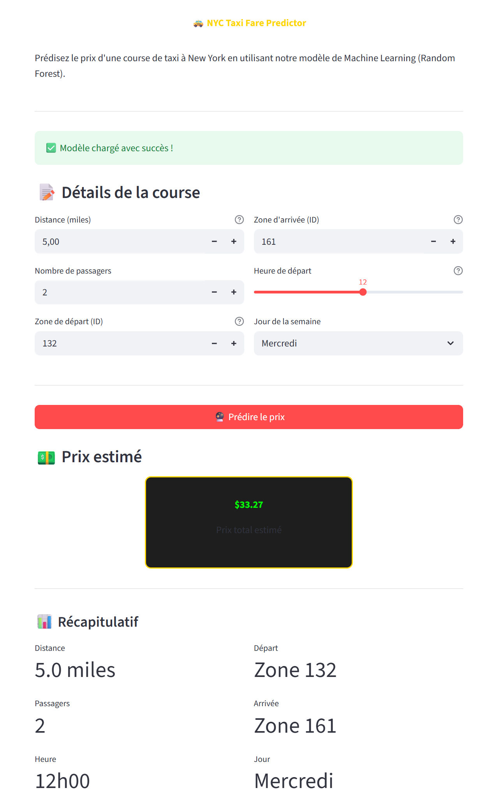

# **Projet Big Data - CY Tech 2025**  

JOUDI Haroun, FILALI Amine, OUAD Mouad


## Accès aux Services Web


| Service | Description | URL | Identifiants |
|---------|-------------|-----|--------------|
| **Metabase** | Dashboard d'analyse BI | [metabase.haroun-joudi.com](http://metabase.haroun-joudi.com) | harounjoudi.dev@gmail.com / metabase123 |
| **Airflow** | Orchestration de pipeline | [airflow.haroun-joudi.com](http://airflow.haroun-joudi.com) | airflow / airflow |


### Exercise 3: Schéma Star SQL

**Architecture Star Schema:**

```
┌─────────────────┐
│ dim_datetime    │──┐
│ (24.3M rows)    │  │
└─────────────────┘  │
                     │
┌─────────────────┐  │      ┌─────────────────┐
│    dim_zone     │──┼──────│   fact_trip     │
│   (265 rows)    │  │      │  (36.6M rows)   │
└─────────────────┘  │      └─────────────────┘
                     │
┌─────────────────┐  │
│ dim_payment_type│──┤
│    (7 rows)     │  │
└─────────────────┘  │
                     │
┌─────────────────┐  │
│   dim_vendor    │──┤
│    (4 rows)     │  │
└─────────────────┘  │
                     │
┌─────────────────┐  │
│  dim_ratecode   │──┘
│    (7 rows)     │
└─────────────────┘
```

**Tables Créées:**

| Table | Type | Lignes | Description |
|-------|------|--------|-------------|
| `dim_datetime` | Dimension | 24,3M | Dates et heures uniques |
| `dim_zone` | Dimension | 265 | Zones taxi NYC |
| `dim_payment_type` | Dimension | 7 | Types de paiement |
| `dim_vendor` | Dimension | 4 | Fournisseurs TLC |
| `dim_ratecode` | Dimension | 7 | Codes tarifaires |
| `fact_trip` | Fait | 36,6M | Transactions de trajets |


---

### Exercise 4: Dashboard Metabase

**Objectif:** Dashboard BI professionnel

**Visualisations:**


1. **Trajets Quotidiens**
   - Type: Line chart
   - Métrique: COUNT(*) par jour
   - Insight: Tendances temporelles

2. **Distribution Géographique**
   - Type: Bar chart
   - Métrique: Trajets par borough
   - Insight: Manhattan domine (60%)

3. **Tarif Moyen par Heure**
   - Type: Line chart
   - Métrique: AVG(fare_amount) par heure
   - Insight: Pics aux heures de pointe


4. **Types de Paiement**
   - Type: Pie chart
   - Métrique: Distribution des paiements
   - Insight: Carte bancaire #1 (70%)


**Accès:** [metabase.haroun-joudi.com](http://metabase.haroun-joudi.com)

---

### Exercise 5: Service ML de Prédiction

**Objectif:** Prédire `total_amount` avec RMSE < 10

**Approche:**

#### Modèle: Random Forest Regressor
```python
RandomForestRegressor(
    n_estimators=100,
    max_depth=15,
    min_samples_split=10,
    random_state=42
)
```

#### Features Engineered:
- `trip_distance`
- `pickup_hour`, `pickup_day`, `pickup_month`
- `passenger_count`
- One-hot: `PULocationID`, `payment_type`, `RatecodeID`


**Résultats:**
- RMSE: **6.56** (< 10 target)
- Entraînement: 10 minutes
- Mémoire: <4GB (serveur safe)

**Interface Streamlit:**
- Formulaire de saisie (distance, heure, zone, etc.)
- Prédiction en temps réel
- Visualisation features importantes



---

### Exercise 6: Orchestration Airflow

**Objectif:** Automatiser pipeline end-to-end

**DAG: `nyc_taxi_pipeline`**

```python
# 5 tâches en cascade
spark_data_ingestion >> load_data_warehouse >> \
ml_preprocessing >> ml_training >> pipeline_complete
```

**Détails des Tâches:**

| # | Tâche | Type | Durée | Description |
|---|-------|------|-------|-------------|
| 1 | `spark_data_ingestion` | DockerOperator | 30 min | Ingestion Spark complète (Ex01-02) |
| 2 | `load_data_warehouse` | BashOperator | 1 min | Vérification PostgreSQL (Ex03) |
| 3 | `ml_preprocessing` | DockerOperator | 5 min | Échantillonnage données (Ex05) |
| 4 | `ml_training` | DockerOperator | 10 min | Entraînement modèle (Ex05) |
| 5 | `pipeline_complete` | BashOperator | Instant | Notification succès |

**Accès:** [airflow.haroun-joudi.com](http://airflow.haroun-joudi.com)  
**Login:** airflow / airflow

