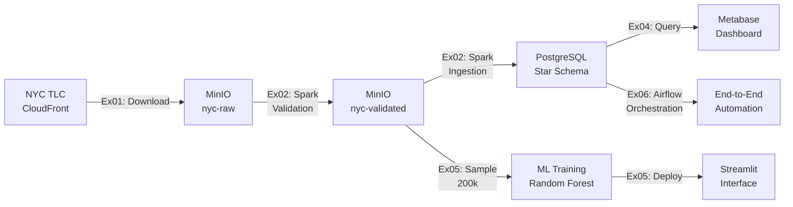

# 🚀 NYC Taxi Big Data Pipeline - Production Deployment

**Projet Big Data - CY Tech 2025**  

JOUDI Haroun, FILALI Amine, OUAD Mouad

---

## 📊 Vue d'Ensemble du Projet

Ce projet implémente une pipeline Big Data complète de bout en bout pour l'analyse de **36,6 millions** de trajets de taxis NYC en 2023. L'architecture comprend l'ingestion de données avec Spark, un entrepôt de données star schema, un dashboard BI, un service de prédiction ML, et une orchestration automatisée avec Airflow.

### 🎯 Objectifs Accomplis

- ✅ **Exercise 1:** Récupération automatisée de 36,6M trajets depuis NYC TLC
- ✅ **Exercise 2:** Validation et ingestion avec Apache Spark (94% taux de réussite)
- ✅ **Exercise 3:** Entrepôt de données star schema (5 dimensions + 1 fait)
- ✅ **Exercise 4:** Dashboard Metabase
- ✅ **Exercise 5:** Service ML de prédiction de tarifs (RMSE 6.56 < 10)
- ✅ **Exercise 6:** Orchestration Airflow (pipeline automatisé 5 tâches)

---
## 🌐 Accès aux Services Web

---

| Service | Description | URL | Identifiants |
|---------|-------------|-----|--------------|
| 🔥 **Spark Master** | Interface de monitoring Spark | [spark-web-ui.haroun-joudi.com](http://spark-web-ui.haroun-joudi.com) | — |
| 📦 **MinIO Console** | Stockage S3 des données brutes | [minio-console.haroun-joudi.com](https://minio-console.haroun-joudi.com) | minio / minio123 |
| 📊 **Metabase** | Dashboard d'analyse BI | [metabase.haroun-joudi.com](http://metabase.haroun-joudi.com) | harounjoudi.dev@gmail.com / metabase123 |
| 🤖 **ML Service** | Prédiction tarifaire Streamlit | [ml-service.haroun-joudi.com](https://ml-service.haroun-joudi.com) | — |
| 🔄 **Airflow** | Orchestration de pipeline | [airflow.haroun-joudi.com](https://airflow.haroun-joudi.com) | airflow / airflow |
| 🗄️ **PostgreSQL** | Data Warehouse | `bigdata-1:5432` | postgres / postgres |

---

## 🏗️ Architecture Technique

### Infrastructure Docker (9 Services)

```
┌─────────────────────────────────────────────────────┐
│                  Docker Network                      │
│           projet_big_data_cytech_25_spark-network   │
├──────────────┬──────────────┬───────────────────────┤
│ Spark Cluster│ Storage Layer│  Applications Layer   │
├──────────────┼──────────────┼───────────────────────┤
│ spark-master │    MinIO     │      Metabase         │
│ spark-w1     │  PostgreSQL  │    ML Service         │
│ spark-w2     │              │  Airflow (webserver)  │
│              │              │  Airflow (scheduler)  │
│              │              │  Airflow (postgres)   │
└──────────────┴──────────────┴───────────────────────┘
```

### Flux de Données



---

## 📋 Déploiement et Gestion

### Démarrage

```bash
# Cloner le projet
git clone <repository>
cd projet_big_data_cytech_25

# Build
docker compose up -d --build

# Démarrer tous les services
docker compose up -d

# Vérifier le statut
docker compose ps
```

---

## 📊 Détails des Exercices

### Exercise 1: Récupération de Données

**Objectif:** Télécharger automatiquement les données NYC 2023

**Implémentation:**
- Scala avec MinIO Java SDK
- 12 mois (Janvier-Décembre 2023)
- Stream direct vers S3

**Résultats:**
- 38,9M trajets téléchargés
- Stockés dans `s3://nyc-raw/2023/`

**Exécution:**
```bash
cd ex01_data_retrieval
sbt assembly
docker exec spark-master spark-submit \
  --master spark://spark-master:7077 \
  --packages org.apache.hadoop:hadoop-aws:3.3.4 \
  target/scala-2.13/ex01-assembly-1.0.jar
```

---

### Exercise 2: Validation et Ingestion Spark

**Objectif:** Valider et charger dans PostgreSQL

**Règles de Validation:**
- Distance > 0 et < 500 miles
- Montants >= 0
- Dates valides (2023)
- Coordonnées GPS NYC

**Défis Résolus:**

#### 1. OutOfMemoryError
**Problème:** 36,6M lignes causaient crashes mémoire  
**Solution:**
```scala
// Configuration optimisée
--driver-memory 16g
--executor-memory 12g
.config("spark.sql.autoBroadcastJoinThreshold", "100MB")
```

#### 2. Duplicate Key Errors
**Problème:** Re-exécution causait violations de contraintes  
**Solution:**
```scala
// Logique idempotente avec upsert
trips.write
  .mode(SaveMode.Append)
  .option("truncate", "false")
  .jdbc(url, "fact_trip", connectionProperties)
```

#### 3. Java 17 Module Access
**Problème:** Erreurs de réflexion Hadoop  
**Solution:**
```bash
--conf spark.driver.extraJavaOptions="--add-opens=java.base/..."
```

**Résultats:**
-  36,6M trajets valides (94%)
-  2,3M trajets rejetés (6%)
-  Temps: ~1 heure
-  Stockage: 11GB PostgreSQL

**Exécution:**
```bash
cd ex02_data_ingestion
sbt assembly
docker exec spark-master spark-submit \
  --master spark://spark-master:7077 \
  --driver-memory 16g \
  --executor-memory 12g \
  --packages org.apache.hadoop:hadoop-aws:3.3.4,org.postgresql:postgresql:42.7.1 \
  target/scala-2.13/ex02-assembly-1.0.jar
```

---

### Exercise 3: Schéma Star SQL

**Architecture Star Schema:**

```
┌─────────────────┐
│ dim_datetime    │──┐
│ (24.3M rows)    │  │
└─────────────────┘  │
                     │
┌─────────────────┐  │      ┌─────────────────┐
│    dim_zone     │──┼──────│   fact_trip     │
│   (265 rows)    │  │      │  (36.6M rows)   │
└─────────────────┘  │      └─────────────────┘
                     │
┌─────────────────┐  │
│ dim_payment_type│──┤
│    (7 rows)     │  │
└─────────────────┘  │
                     │
┌─────────────────┐  │
│   dim_vendor    │──┤
│    (4 rows)     │  │
└─────────────────┘  │
                     │
┌─────────────────┐  │
│  dim_ratecode   │──┘
│    (7 rows)     │
└─────────────────┘
```

**Tables Créées:**

| Table | Type | Lignes | Description |
|-------|------|--------|-------------|
| `dim_datetime` | Dimension | 24,3M | Dates et heures uniques |
| `dim_zone` | Dimension | 265 | Zones taxi NYC |
| `dim_payment_type` | Dimension | 7 | Types de paiement |
| `dim_vendor` | Dimension | 4 | Fournisseurs TLC |
| `dim_ratecode` | Dimension | 7 | Codes tarifaires |
| `fact_trip` | Fait | 36,6M | Transactions de trajets |


---

### Exercise 4: Dashboard Metabase

**Objectif:** Dashboard BI professionnel

**Visualisations:**


1. **Trajets Quotidiens**
   - Type: Line chart
   - Métrique: COUNT(*) par jour
   - Insight: Tendances temporelles

2. **Distribution Géographique**
   - Type: Bar chart
   - Métrique: Trajets par borough
   - Insight: Manhattan domine (60%)

3. **Tarif Moyen par Heure**
   - Type: Line chart
   - Métrique: AVG(fare_amount) par heure
   - Insight: Pics aux heures de pointe


4. **Types de Paiement**
   - Type: Pie chart
   - Métrique: Distribution des paiements
   - Insight: Carte bancaire #1 (70%)


**Accès:** [metabase.haroun-joudi.com](http://metabase.haroun-joudi.com)

---

### Exercise 5: Service ML de Prédiction

**Objectif:** Prédire `total_amount` avec RMSE < 10

**Approche:**

#### Modèle: Random Forest Regressor
```python
RandomForestRegressor(
    n_estimators=100,
    max_depth=15,
    min_samples_split=10,
    random_state=42
)
```

#### Features Engineered:
- `trip_distance`
- `pickup_hour`, `pickup_day`, `pickup_month`
- `passenger_count`
- One-hot: `PULocationID`, `payment_type`, `RatecodeID`


**Résultats:**
- RMSE: **6.56** (< 10 target)
- Entraînement: 10 minutes
- Mémoire: <4GB (serveur safe)

**Interface Streamlit:**
- Formulaire de saisie (distance, heure, zone, etc.)
- Prédiction en temps réel
- Visualisation features importantes


---

### Exercise 6: Orchestration Airflow

**Objectif:** Automatiser pipeline end-to-end

**DAG: `nyc_taxi_pipeline`**

```python
# 5 tâches en cascade
spark_data_ingestion >> load_data_warehouse >> \
ml_preprocessing >> ml_training >> pipeline_complete
```

**Détails des Tâches:**

| # | Tâche | Type | Durée | Description |
|---|-------|------|-------|-------------|
| 1 | `spark_data_ingestion` | DockerOperator | 30 min | Ingestion Spark complète (Ex01-02) |
| 2 | `load_data_warehouse` | BashOperator | 1 min | Vérification PostgreSQL (Ex03) |
| 3 | `ml_preprocessing` | DockerOperator | 5 min | Échantillonnage données (Ex05) |
| 4 | `ml_training` | DockerOperator | 10 min | Entraînement modèle (Ex05) |
| 5 | `pipeline_complete` | BashOperator | Instant | Notification succès |

**Accès:** [airflow.haroun-joudi.com](http://airflow.haroun-joudi.com)  
**Login:** airflow / airflow

